# Efficient AI models for cost reduction of drone navigation modules

## Summary

| Key                                   | Value                                                              |
| :------------------------------------ | :----------------------------------------------------------------- |
| Company Name                          | [Lendurai](https://lendurai.com/)                                  |
| Company Representative Name           | Siim Maivel                                                        |
| Development Team Lead Name            | Tambet Matiisen                                                   |
| Development Team Lead E-mail          | [tambet.matiisen@ut.ee](mailto:tambet.matiisen@ut.ee)              |
| Duration of the Demonstration Project | 10.2024 – 05.2025                                                 |
| Final Report                          | [Final_report_Lendurai.docx](report/Final_report_Lendurai.docx)    |

# Description

## Objectives of the Demonstration Project

The goal of the demonstration project was to validate technologies that will make the Lendurai GNSS-denied navigation module more affordable while ensuring high precision.

To achieve the goal we aimed to test and validate AI methods for two key subsystems in the GNSS-denied navigation: relative positioning and absolute positioning. These methods enable the use of visual navigation of drones in case the signal from global navigation satellites is not available. In particular, we validate how to combine the contradictory requirements of visual-inertial odometry (relative positioning) and feature matching of camera images with aerial images (absolute positioning).

The end goal is to validate efficient algorithms that would enable manufacturing of a cost-effective and precise drone navigation system for GNSS-denied zones.

## Activities and Results of the Demonstration Project

### Challenge

Lendurai localization module for GNSS-denied zones is currently sourced from external partners. This made the end product too expensive and complicated. The challenge was to validate AI algorithms that would enable replacing the localization module with an AI-based solution that would be cheaper to manufacture and would therefore make the product more competitive.

During the project the challenge was narrowed down to the following steps:

1. Validation of cost-effective sensor set for the localization module.
2. Validation of visual-inertial relative positioning algorithms with this sensor set.
3. Validation of feature-matching absolute positioning algorithms with this sensor set.

Initially we assumed that the hardware part of the localization module is already done and we can focus more on the software side. But the reality was that the hardware was not finished by the time the project started and we had to build the prototype from scratch. That took more time than planned and left less time for software adjustments and experiments. In the end we could not build the full localization system, but just validate that the sensor set is suitable for the planned relative and absolute positioning methods.

Additionally we decided to not do validation of existing absolute positioning methods in academic literature, as initial review suggested they were too complicated for the cost-effective solution we were aiming for. Instead a novel method using template matching with neural networks was developed as part of Gregor Nepste’s master’s thesis. This method forms the basis for experiments in this project and also future work.

### Activities Implemented and Results Achieved

Following activities were implemented during the project:

1. A prototype localization module was created. The prototype included the following sensors and other hardware:  
   * Downwards looking grayscale wide-angle camera with global shutter.
   * Regular rolling shutter camera facing forward-down at 45-degree angle.
   * Inertial measurement unit (IMU) capable of measuring acceleration and angular velocity in three axes.
   * Lidar/altimeter capable of measuring height of the drone from ground.
   * Temperature and barometric sensor for estimating altitude from air pressure.
   * Magnetometer for estimating the heading of the drone.
   * Dual antenna RTK GNSS device for measuring ground truth location, heading and speed of the drone.
   * Raspberry Pi 5 minicomputer to perform recording from sensors.
   * Raspberry Pi 5G hat for mobile internet connection during the flight. Necessary for RTK GNSS position corrections and also for convenience.
2. Multiple test flights were performed. Sensor readings were recorded and later analyzed offline.
3. Sensor recordings were submitted to commercial providers for evaluation of suitability for visual-inertial localization.
4. Absolute positioning methodology using template matching with neural networks was developed as part of Gregor Nepste’s master’s thesis.
5. The absolute positioning methodology was validated off-line on real-world recordings.

| | | |
|-|-|-|
| 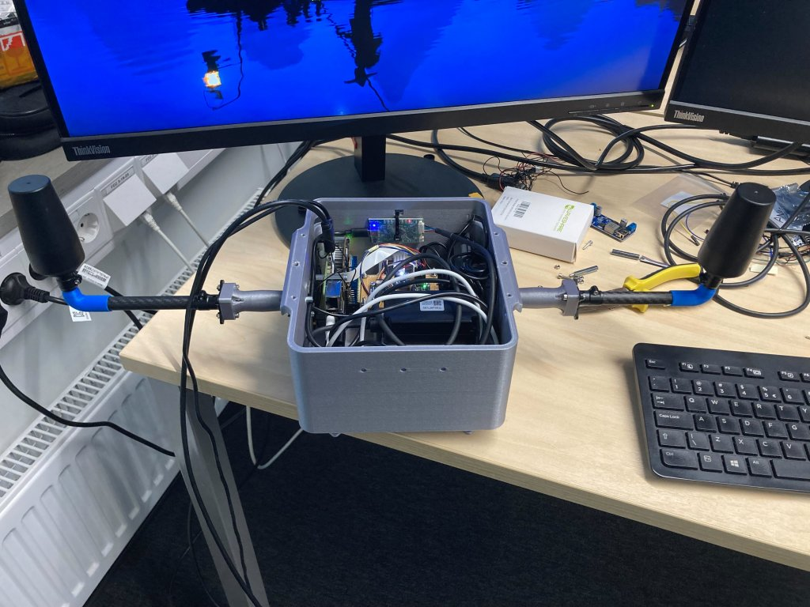 | 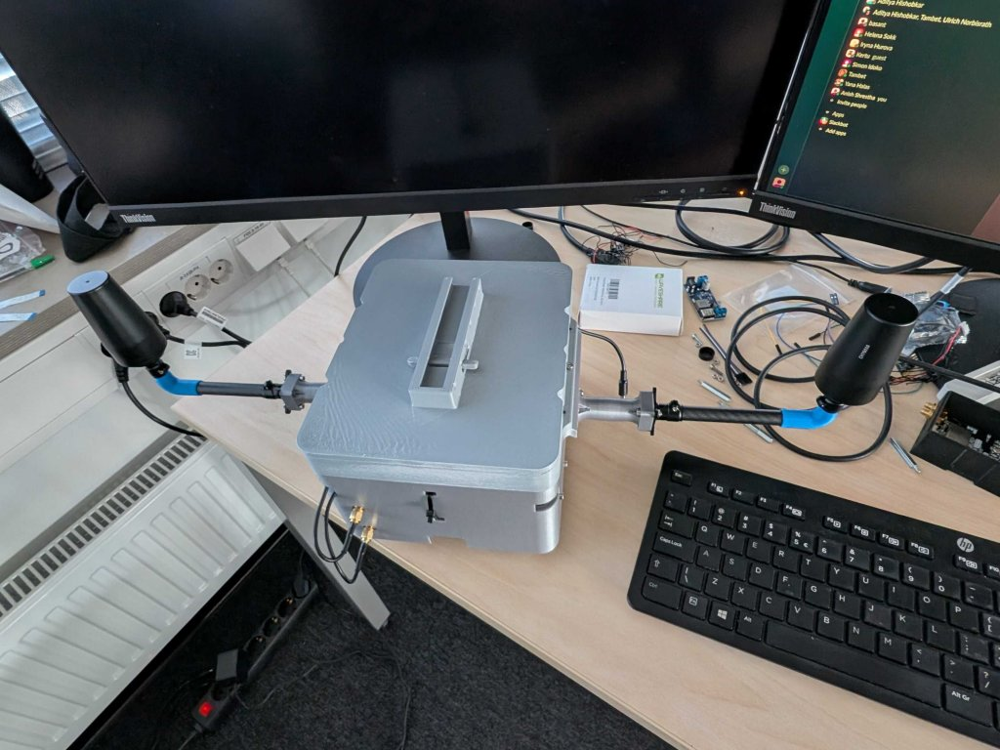 | 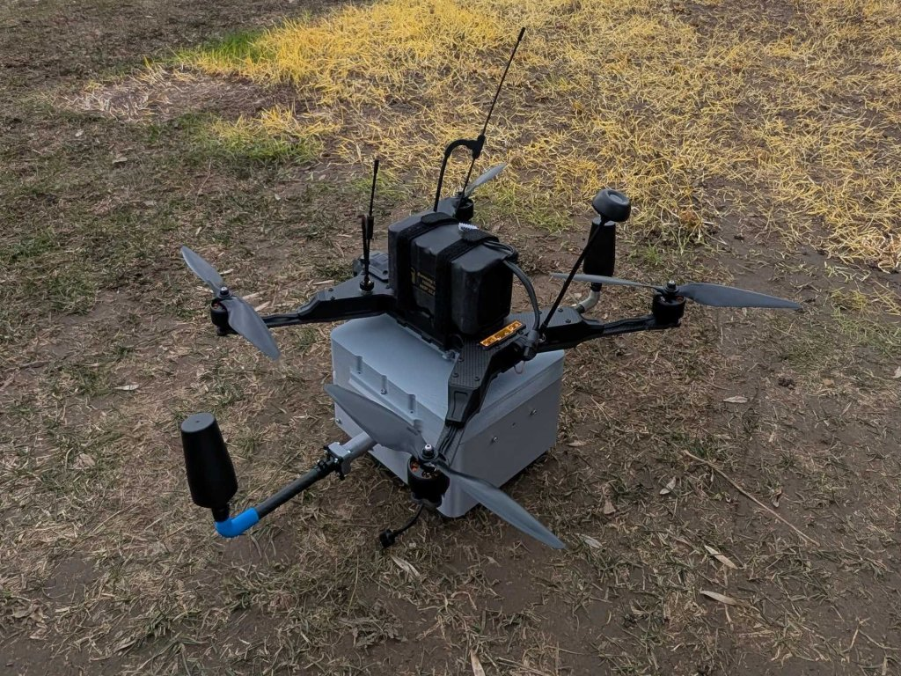 |

**Figure 1.** Preparing of the prototype, from left: open box, closed box, box attached to a drone.

### Data Sources

* Data recorded from test drone flights. These were used for validating the sensor accuracy and for evaluation of the sensor set suitability both for relative and absolute positioning tasks.
* Drone photos of Tartu city performed by 3DI. These were used for developing the absolute positioning methodology as part of Gregor Nepste’s master’s thesis.
* Orthophotos from Estonian Land Board. These were used as a map to match the drone camera images against.
* Google Maps satellite images. These were also used as a map to match the drone camera images against.

### AI Technologies

For relative positioning we decided to rely on off-the-shelf technology due to its maturity. Visual-inertial odometry (VIO) is used, which combines the relative movement estimates both from camera and IMU. We decided to evaluate solutions by two companies: Commercial Provider A and Commercial Provider B.

For absolute positioning template matching with pre-trained neural networks was used. Template matching is a common idea in computer vision. In this particular case we consider the camera image as a template and match it with (slide over) an aerial image collected previously with a surveillance drone or satellite. Naive matching of pixels is unreliable due to different seasons, light conditions, camera angles, etc. To overcome this brittleness we pass both the camera image and aerial map through a neural network and perform matching at the neural-network feature level. These features are more agnostic to the seasons, light conditions, camera angles, etc. Matching of camera-image features with aerial-map features is a simple 2D convolution operation that can be done very efficiently on modern hardware. The result of this operation is a heatmap, where the point with highest score represents the most probable location of the drone. The location on the raster map can be easily converted into absolute (GPS) coordinates.

The system needs a camera, IMU, barometer/lidar and magnetometer sensors:

* The approximate region on the map needs to be estimated to perform successful matching. This can be done with visual-inertial odometry. The template matching on map does not replace the visual-inertial odometry, but acts on top of it to anchor the position to visual features in the real world.
* To match the scale (resolution) of the camera image with a map, the altitude of the drone needs to be estimated. Either lidar or barometer can be used for that. The use of neural-network features makes the system somewhat tolerant to errors in altitude.
* To match the orientation of the camera image with the map, the heading of the drone needs to be estimated. This can be done using a magnetometer and/or IMU. Again, the use of neural-network features makes the system somewhat tolerant to errors in orientation.

To refine the position iteratively over multiple matching attempts, a particle filter can be utilized. Particles are sampled according to heatmap scores and over time they should converge into the most probable location of the drone. Motion estimate from the visual-inertial subsystem is used in the particle-filter motion-estimation step. The particle filter was not implemented in this project phase.

### Technological Results

#### 1. Sensor validation results

We performed test flights using the prototype localization module. Four recording sessions were performed: April 14th. May 19th. May 22nd and June 4th. 2025. The most reliable data from the last session was used for sensor validation.

Following validations were performed:
1. Time synchronization between IMU and camera measured in milliseconds between two messages (important for visual-inertial odometry).
2. Altitude estimation accuracy from lidar and barometer measured as error in meters between the estimated altitude and the ground truth altitude from RTK GNSS.
3. Heading estimation accuracy from magnetometer measured as error in degrees between the estimated heading and the ground truth heading from RTK GNSS.

*Table 1. Delay of sensors compared to IMU. Anything close to 5 ms was considered acceptable by VIO solution providers.*

| Sensor                   | Delay (ms) |
| :----------------------- | ---------: |
| Front regular camera     |      6.159 |
| Bottom wide-angle camera |      6.378 |

When evaluating altitude and heading errors, it became clear that the tilt of the drone may affect it, i.e. lidar is not pointing exactly downwards. To correct this we estimated roll and pitch angles from IMU by assuming that its readings should always contain the gravity vector. Then we corrected lidar and magnetometer readings using this pitch and roll. In practice direct formulas were developed that do not calculate roll and pitch explicitly.

For smoothing a Butterworth low-pass filter was applied, as implemented in Scipy. As Butterworth filter can only be applied to offline data, simple exponential moving average (EMA) was also tried, as it can be applied in online settings. The results were largely similar; EMA tended to delay all changes (move slightly to the right).

*Table 2. Average altitude estimation errors compared to RTK GNSS ground truth.*

| Method                                  | Error (m) |
| :-------------------------------------- | --------: |
| Lidar raw                               |      9.15 |
| Lidar + IMU tilt correction             |      4.39 |
| Lidar + IMU tilt correction + smoothing |      2.52 |
| Barometer                               |      7.86 |

*Table 3. Average heading errors compared to RTK GNSS ground truth.*

| Method                                         | Error (°) |
| :--------------------------------------------- | --------: |
| Magnetometer raw                               |     65.82 |
| Magnetometer + smoothing                       |     64.73 |
| Magnetometer + IMU tilt correction + smoothing |     54.01 |

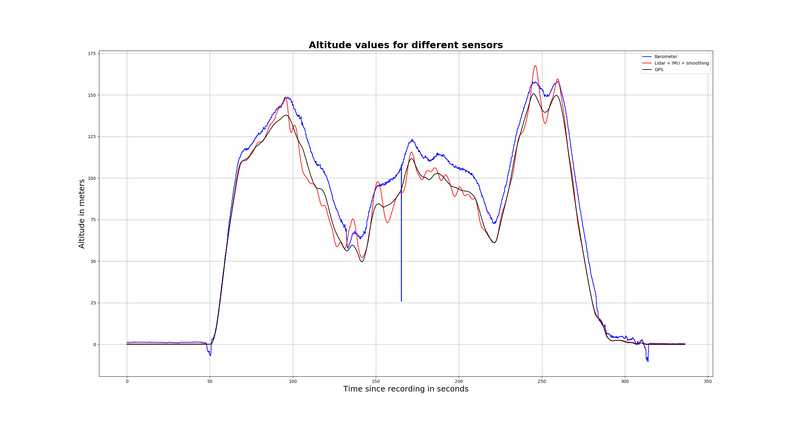

**Figure 2.** Altitude values for different sensors: barometer, best lidar and GNSS. After IMU tilt correction and smoothing lidar achieves the best result.

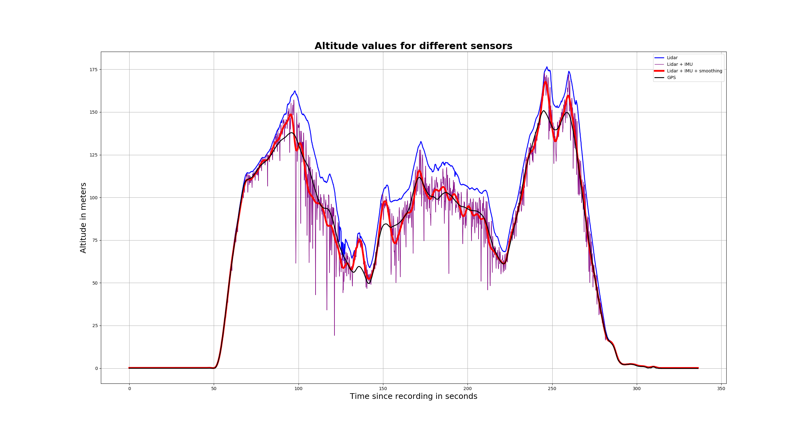

**Figure 3.** Effect of IMU tilt correction and smoothing to lidar altitude estimate. Clearly IMU tilt correction brings the altitude estimate closer to ground truth, but smoothing is necessary to remove the noise from actual drone movements.

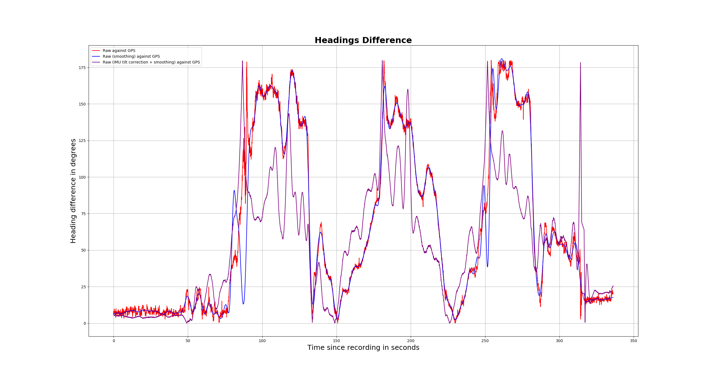

**Figure 4.** Heading error with different methods: raw magnetometer, magnetometer with smoothing and magnetometer with IMU tilt correction and smoothing. Clearly the improvement in error comes from IMU tilt correction rather than smoothing.

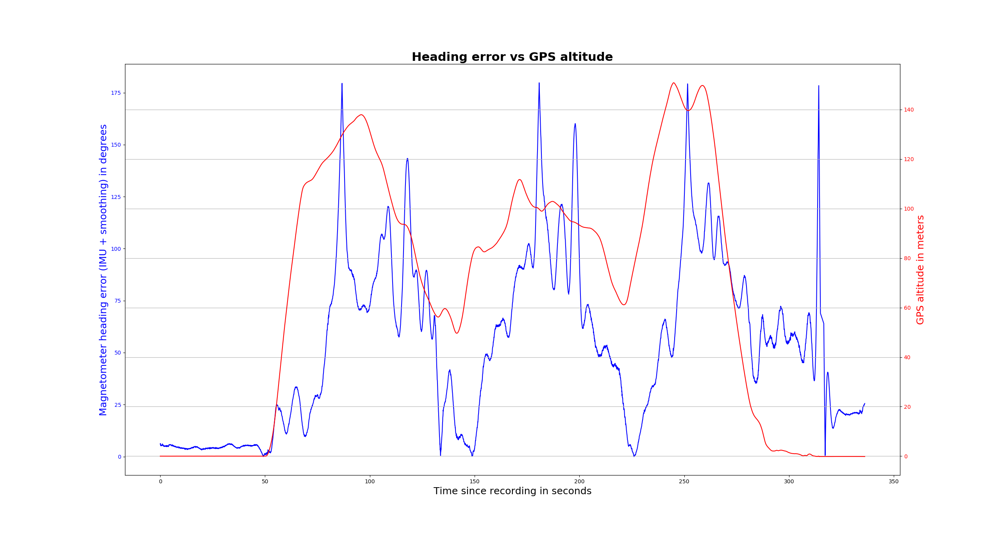

**Figure 5.** Heading error with magnetometer compared to altitude. Surprisingly heading errors seem to be correlated with drone altitude.

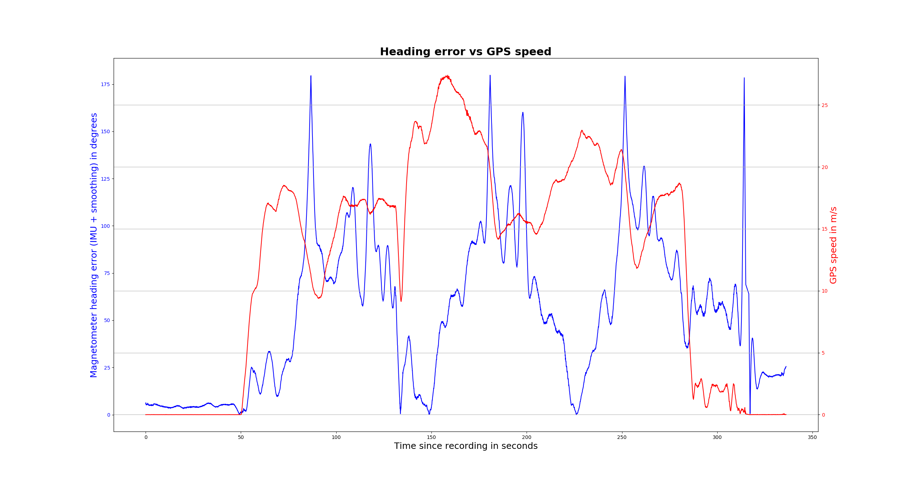

**Figure 6.** Heading error with magnetometer compared to speed (e.g. motor activity). Surprisingly the heading error is lowest at high speeds.

#### 2. Relative positioning validation results

The validation results from Commercial Provider A and Commercial Provider B had not arrived by the time of submitting the report. Early feedback was that the IMU is too noisy to be practically usable, so probably they have to rely on visual odometry only. One possible reason could be that the localization payload was not attached rigidly enough to the drone – just picatinny rail and zip ties. Loose connection can amplify the vibration already in the system. Additionally the IMU values were clipped at 20 m/s² for the z (top-down) axis. We plan to address these problems in future versions of the system.

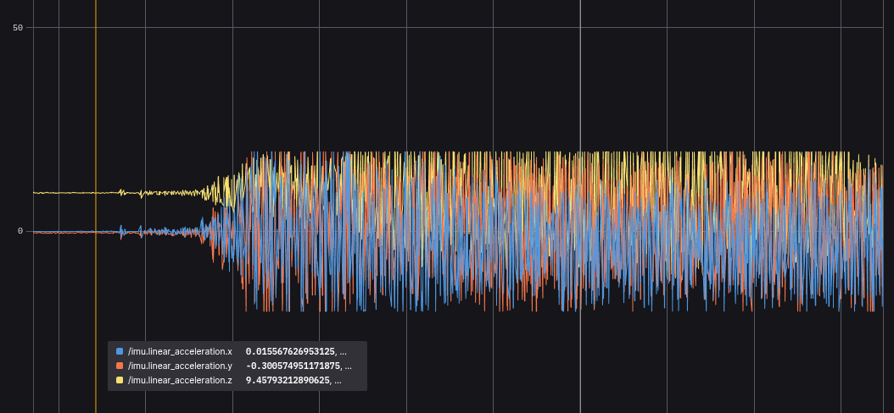
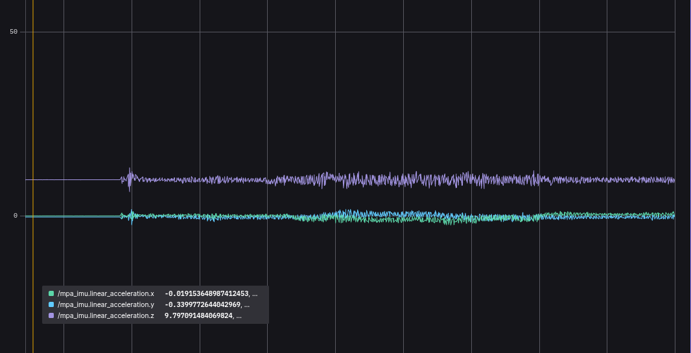

**Figure 7.** IMU measured accelerations on our prototype (top) and reference system (bottom). Our system experiences much bigger vibrations and the acceleration in the z axis is clipped to 20 m/s².

#### 3. Absolute positioning initial results

Following results are taken from Gregor Nepste’s master’s thesis *“Absolute positioning of a drone using aerial images”*. In the thesis the template-matching approach was validated on 113 images from the Tartu city orthophoto dataset collected by 3DI. Different pre-trained models were compared and resilience to altitude and heading errors was evaluated.

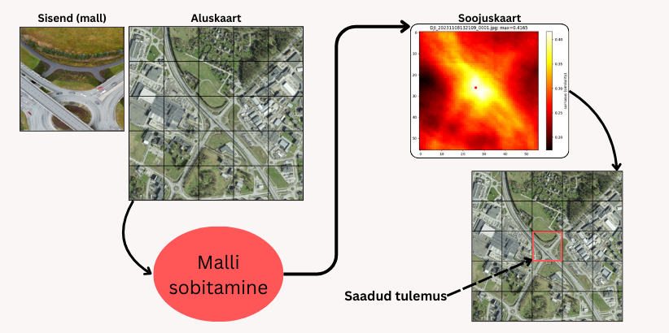

**Figure 8.** Template matching scheme. The drone camera image is used as a template to match with the base map. The matching scores form a heatmap and the point with the highest score is the location of the drone image. For illustration the applications of template matching are not overlapping, but in practice they are. As long as the base map is georeferenced, the heatmap pixel coordinates can be easily converted to absolute (GPS) coordinates.

*Table 4. Comparison of raw positioning errors with different pre-trained models. While DINOv2 large achieved the best results, the results of DINOv2 base were comparable and the model was much more realistic to deploy on a limited-performance device. This experiment was conducted with 113 images.*

| Model        | Mean (m) | Min (m) | Max (m) | Stddev (m) |
| :----------- | -------: | ------: | ------: | ----------: |
| ResNet50     |   165.07 |    5.90 |  706.79 |      193.51 |
| DINOv2 base  |    50.97 |    0.00 |  388.83 |       71.67 |
| DINOv2 small |   100.57 |    0.00 |  588.53 |      127.30 |
| DINOv2 large |    45.97 |    0.00 |  271.42 |       55.05 |
| WALDO30      |   364.16 |   60.80 |  673.76 |      148.05 |

*Table 5. Comparison of positioning errors at different simulated altitudes. The altitude was simulated by cropping the camera image. The best results were achieved at an altitude of 80 metres, but the dataset is too small to draw too strong conclusions from it. This experiment was conducted with 10 images.*

| Altitude (m) | Mean (m) | Median (m) | Min (m) | Max (m) | Stddev (m) |
| -----------: | -------: | ---------: | ------: | ------: | ----------: |
|          120 |   91.53 |     63.34 |   16.97 |  281.25 |      73.55 |
|           80 |   74.60 |     60.61 |   26.84 |  241.26 |      57.90 |
|           60 |   96.91 |     67.31 |   12.00 |  230.89 |      70.41 |
|           40 |  114.18 |     80.33 |   12.00 |  283.29 |      91.19 |
|           30 |  102.69 |    105.72 |   12.00 |  186.34 |      59.06 |
|           20 |  130.02 |    155.99 |   24.00 |  214.72 |      66.47 |
|           10 |  125.24 |    131.70 |   16.97 |  256.60 |      80.73 |

*Table 6. Comparison of positioning errors with different simulated heading errors. The error was simulated by increasing the camera-image rotation by the error amount. The error was acceptable up to 4 degrees, but the dataset was too small to draw too strong conclusions from it. This experiment was conducted with 10 images.*

| Heading error (°) | Mean (m) | Median (m) | Min (m) | Max (m) | Stddev (m) |
| ----------------: | -------: | ---------: | ------: | ------: | ---------: |
|                 1 |    70.64 |      51.50 |   18.18 |  216.38 |      57.66 |
|                 2 |    62.35 |      62.67 |   18.18 |  149.56 |      38.26 |
|                 3 |    72.15 |      66.74 |   38.63 |  109.29 |      21.64 |
|                 4 |    70.90 |      69.17 |   38.63 |  103.13 |      18.82 |
|                 5 |   121.93 |      89.60 |   18.18 |  306.01 |      94.55 |
|                10 |   116.06 |      83.24 |   33.90 |  277.77 |      71.85 |
|                20 |   174.57 |     111.15 |   12.79 |  595.60 |     167.56 |
|                30 |   276.43 |     303.90 |   69.09 |  406.80 |     110.95 |
|                40 |   340.86 |     294.19 |   43.70 |  785.65 |     203.22 |

#### 4. Absolute positioning real-world results

*Table 7. Comparison of positioning error different altitude sources. This experiment was done on 10 highly discriminative images. While the barometer seems to have the best results, possibly it just benefited from a slightly larger map area due to higher altitude.*

| Altitude source | Mean (m) | Median (m) | Min (m) | Max (m) | Stddev (m) |
| :-------------- | -------: | ---------: | ------: | ------: | ----------: |
| RTK GNSS        |    32.75 |      26.60 |    8.13 |  102.05 |      29.24 |
| Barometer       |    31.08 |      34.23 |    0.00 |   70.94 |      22.11 |
| Lidar           |    36.15 |      36.68 |    0.00 |   80.80 |      24.59 |

*Table 8. Comparison of positioning error different heading sources. This experiment was done on 10 highly discriminative images. As expected, the RTK GNSS heading is much more accurate than the magnetometer heading.*

| Heading source | Mean (m) | Median (m) | Min (m) | Max (m) | Stddev (m) |
| :------------- | -------: | ---------: | ------: | ------: | ----------: |
| RTK GNSS       |    32.75 |      26.60 |    8.13 |  102.05 |      29.24 |
| Magnetometer   |    65.28 |      42.01 |    0.00 |  229.60 |      70.41 |

*Table 9. Comparison of positioning error with different models. This experiment was done on 100 images from the latest flight. As expected, DINOv2 small has inferior performance compared to DINOv2 base. Models were run on an old GTX 1050 Ti laptop, which probably has comparable performance to Jetson Nano. The average inference time for DINOv2 base was 4.78 seconds while for DINOv2 small it was 1.52 seconds.*

| Model        | Mean (m) | Median (m) | Min (m) | Max (m) | Stddev (m) |
| :----------- | -------: | ---------: | ------: | ------: | ----------: |
| DINOv2 base  |    96.27 |      82.49 |    0.00 |  336.92 |      74.87 |
| DinOv2 small |   154.20 |     124.79 |    0.00 |  361.20 |      99.43 |

*Table 10. Comparison of different sensor sets. RTK GNSS only uses RTK GNSS both for altitude and heading; this can be considered pretty close to ground truth. In the other set magnetometer is used for heading and lidar for height. This experiment was done on 100 images from the latest recording.*

| Sensor set           | Mean (m) | Median (m) | Min (m) | Max (m) | Stddev (m) |
| :------------------- | -------: | ---------: | ------: | ------: | ---------: |
| RTK GNSS only        |    96.27 |      82.49 |    0.00 |  336.92 |      74.87 |
| Magnetometer + lidar |   110.75 |     100.15 |    0.00 |  366.79 |      83.23 |

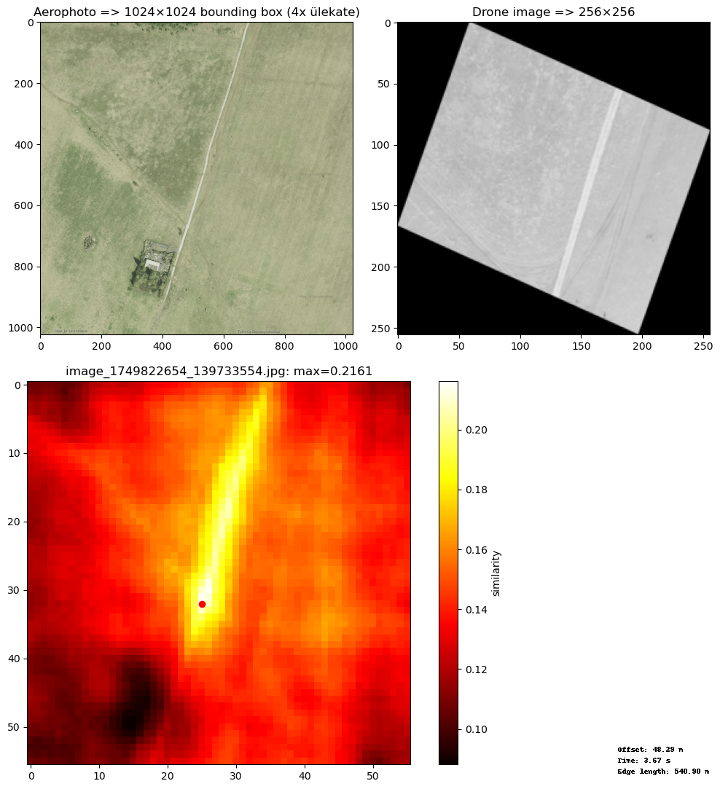

**Figure 9.** The heat map follows the road, as these are all places where the drone image could be.

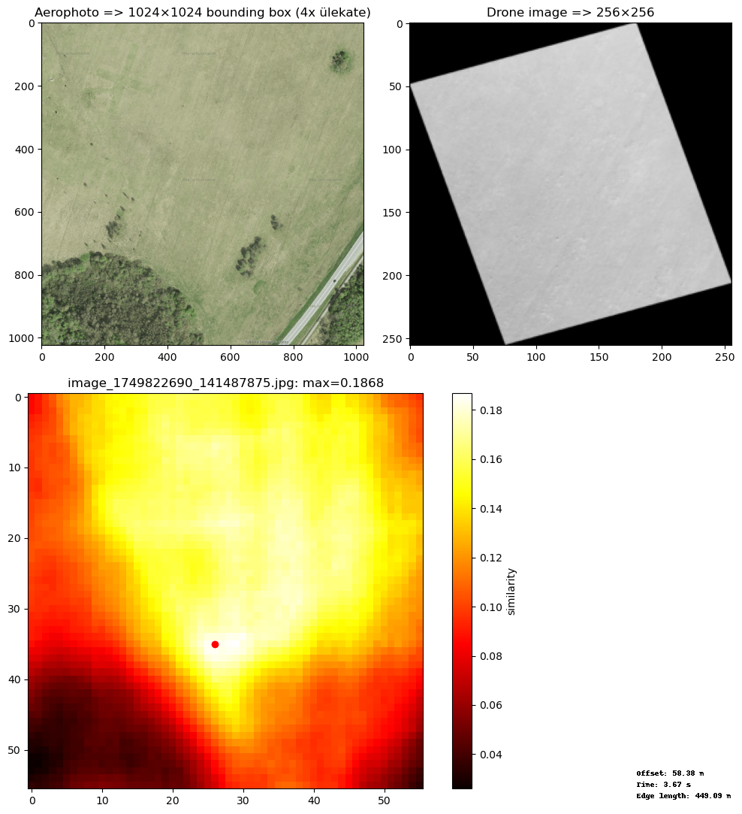

**Figure 10.** While drone image is non-discriminative, the heat map has high scores in the area that possibly matches drone image and low scores where it could never match.

### Technical Architecture

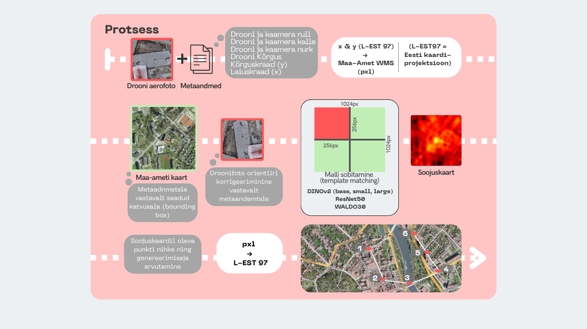

**Figure 11.** General process of the absolute positioning prototype (from Gregor Nepste’s master’s thesis).

### User Interface

There was no special user interface for the product. FoxGlove Studio was used to review the drone footage.

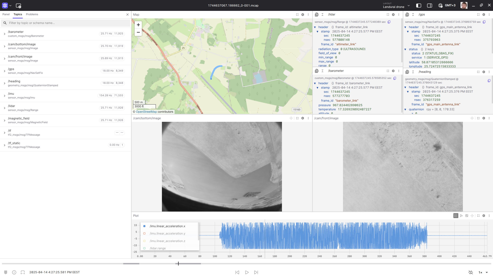

**Figure 12.** FoxGlove Studio view of the drone footage.

### Future Potential of the Technical Solution

The drone positioning methods for GNSS-denied zones are especially important for military use-cases. But they also have civilian use-cases, for example aviation and rescue.

### Lessons Learned

* Lessons learned from the project:
  * IMU picks up all the vibrations of the drone and is very noisy. Extra care needs to be taken to isolate this noise.
  * Lidar and barometer have comparable error in altitude estimation, but barometer is so much cheaper.
  * Magnetometer is very noisy. Extra care needs to be taken to isolate all electromagnetic interference. There were some interesting findings in the project that magnetometer errors are correlated with high altitude and low speed.
  * While the drone is flying, the forward camera at 45 degrees points down and the downwards camera points behind. This choice of camera positions is not necessarily wrong; it makes it possible to use the absolute positioning both during flight and during standstill. But possibly camera types should be unified and an additional forward camera should be installed for FPV usage.
  * In general the template-matching approach worked, but a lot of work remains to get all the tiny details exactly right, e.g. to match the image resolutions and orientations. Possibly custom models need to be trained that are more tolerant to sensor errors.

### Follow-up Activities and Plans for Future

* Implement particle filter to refine the position over multiple iterations.
* Participate in the Funke Fully Autonomous Flight 2.0 competition with this solution.
