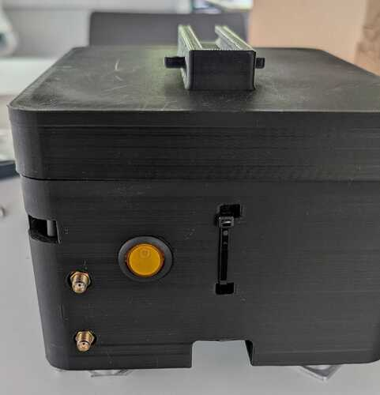

# drone

## System setup

### Single board computer
- Rapsberry Pi 5 (Debian Bookworm 12) 64 bit

### Sensors

#### Cameras
- OV2311 - Global shutter Grayscale
- IMX462 - Rolling shutter color

#### IMU
- MPU6050

#### Lidar/Altimeter
- TF350

#### Temperature + Barometric sensor
- DPS310

#### Magnetometer
- LIS3MDL

#### GPS/RTK Device
- Holybro H-RTK mosaic-H (Dual Antenna Heading)

#### 5G Pi Hat
- RM520N-GL Pi Hat+

## Installation

### Installing ROS2 

To install ROS2 jazzy in Raspberry Pi 5 Bookworm OS, please follow through this [installation instructions](https://forums.raspberrypi.com/viewtopic.php?t=361746#p2250865).It takes some time (few hours) for the installation to complete.   

Once completed, it might show show some `stderr`, but it is because of the older setup version.   

When installed, source the installation by runnig the following command from your ros2_ws (`ros_jazzy` in this case):   
`source install/local_setup.bash`

Or, you can add this command in the end of your `~/.bashrc` so you don't need to do it manually everytime:   
`echo "source ros_jazzy/install/local_setup.bash" >> ~/.bashrc`

### Example testing
- Open a new terminal window and run the following commands:   
`ros2 run demo_nodes_cpp talker`

- In another terminal window, run the following command:   
`ros2 run demo_nodes_cpp listener`

If these nodes run without any error, and you see ROS logs being printed in the terminal windows, then the ROS2 has been successfully installed.

## Inerfacing options
In order to communicate with different sensor, from the `raspi-config`, please enable the following interfacing options:
- i2c
- ssh
- serial port

```
sudo raspi-config
```
Then, select the `interfacing options`, and enable these options.


## Necessary packages/drivers - Dependencies

### Raspberry Pi packages
- libi2c-dev   
```
sudo apt install libi2c-dev
```

### Python dependencies

- [opencv](https://pypi.org/project/opencv-python/)
- [cv-bridge](https://pypi.org/project/cv-bridge/)
- [transforms3d](https://pypi.org/project/transforms3d/)
- [image-geometry](https://github.com/ros-perception/vision_opencv/tree/rolling/image_geometry)   

```
sudo apt install python3-opencv python3-cv-bridge python3-transforms3d python3-image-geometry
```

### C++ depenencies

- [geographicLib](https://geographiclib.sourceforge.io/C++/doc/index.html)

Follow through the [installation guidelines](https://geographiclib.sourceforge.io/C++/doc/install.html) to install goegraphicLib C++ library in your system

### ROS dependencies

- [MPU6050 driver](https://github.com/hiwad-aziz/ros2_mpu6050_driver)
- [ros2-numpy](https://github.com/Box-Robotics/ros2_numpy)
- [tf-transformations](https://github.com/DLu/tf_transformations)
- [GPS-umd](https://github.com/swri-robotics/gps_umd/tree/ros2-devel)
- [geographicLib](https://github.com/geographiclib/geographiclib/tree/main)
- [septentrio-gnss-driver](https://github.com/septentrio-gnss/septentrio_gnss_driver)

```
cd ros2_jazzy/src
git clone https://github.com/hiwad-aziz/ros2_mpu6050_driver.git
git clone https://github.com/Box-Robotics/ros2_numpy.git
git clone https://github.com/DLu/tf_transformations.git
git clone https://github.com/septentrio-gnss/septentrio_gnss_driver.git
git clone https://github.com/swri-robotics/gps_umd.git
git clone https://github.com/geographiclib/geographiclib.git

cd ..
colcon build --symlink-install --packages-select mpu6050driver ros2_numpy tf_transformations septentrio_gnss_driver gps_msgs geogrpahiclib 
source install/local_setup.bash
```

While building this package, it may throw an error. If so, add the following line in the `include/mpu6050driver/mpu6050sensor.h` while importing libraries:   
`#include <array>`   
Also, you might want to change the frame name from `base_link` to `imu_link` in the mpu6050driver. In line 44 in the `src/mpu6050driver.cpp`, change the frame name to `imu_link`.

And then, build the `mpu6050driver` package again.


## Installing drone-payload packages

Once all the dependencies mentioned above are installed, build the required packages. To install these packages, please clone the repo inside the src directory of the ros2 workspace. In this case the ros2 workspace is `ros2_jazzy`. Please run the following commands:   

```
cd ros2_jazzy/src
git clone https://github.com/ai-robotics-estonia/Testing_of_efficient_AI_models_for_cost_reduction_of_drone_navigation_modules.git
colcon build --symlink-install --packages-select camera_pkgs custom_msgs
source install/local_setup.bash
```

## 5G hat internet dial-up
For internet access on-board, there is a 5G Pi hat along with the Raspberry Pi 5. The installation instrutions for the device is mentioned [here](https://www.waveshare.com/wiki/RM520N-GL_5G_HAT%2B).


### Configuring the GPS/RTK device
The GPS/RTK device used here is the [Holybro H-RTK mosaic-H (Dual Antenna Heading)](https://docs.holybro.com/gps-and-rtk-system/h-rtk-mosaic-h/overview-and-specification) device. Instructions for configuraing the device can be found [here](https://docs.holybro.com/gps-and-rtk-system/h-rtk-mosaic-h/setup-and-getting-started-ardupilot).


## Camera Intrinsics
The camera intrinsics are present inside the config directory of the package. These are not published, because one of the camera is an omni-radtan model (IMX462) which is not supported by the `camera_info` topic.


## Extrinsics
The sensor extrinsics are published in the topic `/tf_static`. So, it can be extracted from the bag file.


## Starting and stoppping the data recording

To start and stop the data recording, there is a physical switch in the payload box.   
   
**Figure 1.** Physical ON-OFF switch to start and stop the data recording. 


## Launching the nodes

All nodes are launched at startup, as linux services. These services need to be added to the list of services to be run at boot.   

Copy the contents of the files in the `drone/camera_pkgs/services` inside their respective files in `/etc/systemd/system` directory.   

1. Adding the service to launch cameras, IMU, lidar, barometer, magnetometer   
`sudo nano /etc/systemd/system/ros2_launch.service`   
Copy the contents of the file `drone/camera_pkgs/services/ros2_launch.service` to `/etc/systemd/system/ros2_launch.service`

2. Adding the service to launch the GPS node   
`sudo nano /etc/systemd/system/septentrio.service`   
Copy the contents of the file `drone/camera_pkgs/services/septentrio.service` to `/etc/systemd/system/septentrio.service`   

3. Adding the service to launch the python script enabling the physical switch for data recording   
`sudo nano /etc/systemd/system/switch_script.service`   
Copy the contents of the file `drone/camera_pkgs/services/switch_script.service` to `/etc/systemd/system/switch_script.service`   

Once the service files are ready inside the `/etc/systemd/system` directory, follow these terminal commands:   
```
sudo systemctl daemon-reexec
sudo systemctl daemon-reload
sudo systemctl enable ros2_launch.service
sudo systemctl enable septentrio.service
sudo systemctl enable switch_script.service
```

This runs these services at boot. Now, you can reboot the Pi.

Optional - to test the services immediately (without boot), run the following commands:   
```
sudo systemctl start ros2_launch.service
sudo systemctl start septentrio.service
sudo systemctl start switch_script.service
```


## Online telemetry

For telemetry purposes, [tailscale](https://tailscale.com/) is used in the system, which enables to remotely access the Pi using ssh.   

To use tailscale, login to all devices from the same account, and it groups all those devices together to be remotely accessed.   

```
sudo apt install taiscale -y
sudo tailscale up
sudo tailscale login
```

Once the tailscale is up, you can monitor the status of your devices   
`sudo tailscale status`- This lists all the devices logged in from that account, and you can ssh remotely to any/all of these devices.

`ssh username@ip-address`- Modify the username and ip-address as per your need.


## Bags post-processing

For the bags recorded from the drone flights, the IMU data was quite noisy, mainly because of the mechanical vibrations as the payload box was not very tightly attached with the drone. The payload box was atached using a picatiny rail and some zip ties.   

### Smoothing the IMU data

The [butterworth low pass filter](https://docs.scipy.org/doc/scipy/reference/generated/scipy.signal.butter.html) was used to smooth out the IMU data, and a new bag is created where this smoothed IMU data is published in the topic `/imu/filtered`.

The python script to read the existing bag, create a new topic, publish the smoothed IMU data in that topic and export this newly created bag is present inside the `drone/utils` directory. To export this bag, please run the following commands from the github repo directory `Testing_of_efficient_AI_models_for_cost_reduction_of_drone_navigation_modules`:   
```
python3 drone/utils/bag_filter.py
```
Currently, this script has some default arguments set
- bag directory: Directory where the recorded bag files are located [-d, --directory]
- input file name: Recorded bag filename [-f, --filename]
- output file name: Exported bag filename [-o, --output]

 General usage command looks like this:
```
python3 drone/utils/bag_filter.py -d <bags_directory> -f <input-bag-filename> -o <output-bag-filename>
```

The input bag file and the output bag will be located the same directory.


### Errors calculation

once the new bag file is created with smoothed IMU data in the `/imu/filtered` topic, basic analysis for the bag files - like altitude errors for different sensors, heading errors between magnetometer and grounf truth GPS, etc can be carried out.   

#### Offline error calculation

1. Altitude error   
The payload consists of a few sensors from where the altitide can be determined - barometer and lidar/altimeter. The lidar is facing vertically downwards. Therefore when the drone tilts, the lidar output would not be a vertical distance downwards, but some inclined distance. So, the smoothed out IMU data was used to account for the drone tilt, and this tilt compensated lidar altitudes were smoothed out using the butterworth filter.

2. Heading error   
Magnetometer in general seems to be affected when the drone is flying (motion interference). So, the IMU data and was taken into account to compensate for the motion and the same butterworth filter was used offline to smoothen the heading angles. Heading difference between the motion compensated headings and the ground truth GPS headings were computed and analyzed.

To run the offline error evaluation scripts, from the github repo directory, please run the following command:   
```
python3 drone/utils/evaluate_offline.py
```

#### Online error calculation

However, to carry out the smothing operation online (while recording itself), using the butterworth filter have some limitations. The start and the end of the signals where the filter is applied will be biased towards the original signal, i.e., the smoothign function would smoothen the noisy data points in the middle by removing the abrupt ripples, but the start and end points would be the same.   

To tackle this problem of having an online smoothing, Exponentially Moving Average (EMA) was opted. So, the smoothing happens by taking the weighted averge between the consecutive data points, with the gain factor `alpha`.   
`ema = alpha * data[t] + (1 - alpha) * data[t-1]`   

So, the errors in altitudes and headings are calculated using this averaging where the data needs to be smoothed - tilt compensated lidar altitude and IMU compensated magnetometer headings.   

To run this online evaluation, please run the following command from the github repo directory:   
```
python3 drone/utils/evaluate_online.py
```